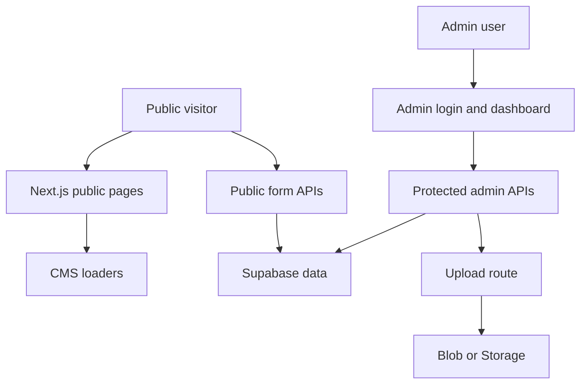

## Executive summary
BuildCivil is a single-company, internet-facing Next.js website with a custom admin dashboard, Supabase-backed CMS, public lead forms, and an admin media pipeline that can write to Vercel Blob or Supabase Storage. The top current risks are concentrated around custom admin authentication/session handling, future role separation as multiple departments are added, and the operational abuse surface of public lead APIs. Live QA on May 14, 2026 confirmed that protected admin APIs and temporary CRUD flows are working in production, which lowers immediate concern about backend integrity, but frontend/admin consistency and secret/session hygiene remain important launch risks.

## Scope and assumptions
- In-scope paths:
  - `/Users/darksider/Documents/consturction company/app`
  - `/Users/darksider/Documents/consturction company/components`
  - `/Users/darksider/Documents/consturction company/lib`
  - `/Users/darksider/Documents/consturction company/middleware.ts`
  - `/Users/darksider/Documents/consturction company/next.config.js`
  - `/Users/darksider/Documents/consturction company/supabase`
- Out-of-scope items:
  - Vercel account-level controls, firewall settings, and deployment permissions
  - Supabase platform internals
  - Local-only development tooling and non-runtime examples
- Validated assumptions:
  - Intended usage: public construction-company marketing site with CMS-driven content and admin dashboard
  - Deployment model: Vercel-hosted Next.js app backed by Supabase and optional Vercel Blob
  - Data sensitivity: lead/contact details, CMS content, media metadata, and admin credentials; no sensitive client document storage
  - Internet exposure: public pages and public form APIs are internet reachable; admin is internet reachable behind cookie auth
  - Authn/authz expectations: custom DB-backed admin auth, with multiple department users and different roles expected soon
  - Tenant model: single-company, not multi-tenant
- Open questions that would materially change risk ranking:
  - Whether MFA or IP/device restrictions will be added before expanding admin users across departments
  - Whether the same deployment will later store more sensitive business documents or customer records

## System model
### Primary components
- Public website:
  - App Router pages under [`app/`](/Users/darksider/Documents/consturction company/app)
  - Shared public UI in [`components/`](/Users/darksider/Documents/consturction company/components)
  - CMS/theme/layout loaders in [`lib/site-pages.ts`](/Users/darksider/Documents/consturction company/lib/site-pages.ts), [`lib/site-settings.ts`](/Users/darksider/Documents/consturction company/lib/site-settings.ts), and [`lib/site-theme.ts`](/Users/darksider/Documents/consturction company/lib/site-theme.ts)
- Admin dashboard:
  - Protected admin shell in [`app/admin/page.tsx`](/Users/darksider/Documents/consturction company/app/admin/page.tsx)
  - Main dashboard/controller in [`components/AdminDashboardClient.tsx`](/Users/darksider/Documents/consturction company/components/AdminDashboardClient.tsx)
  - Dedicated library/editor panels such as [`components/AdminProjectLibraryPanel.tsx`](/Users/darksider/Documents/consturction company/components/AdminProjectLibraryPanel.tsx), [`components/AdminServiceLibraryPanel.tsx`](/Users/darksider/Documents/consturction company/components/AdminServiceLibraryPanel.tsx), and [`components/AdminPackagesPanel.tsx`](/Users/darksider/Documents/consturction company/components/AdminPackagesPanel.tsx)
- Protected server APIs:
  - Generic CRUD in [`app/api/admin/[table]/route.ts`](/Users/darksider/Documents/consturction company/app/api/admin/[table]/route.ts)
  - Specialized admin routes in [`app/api/admin/auth/route.ts`](/Users/darksider/Documents/consturction company/app/api/admin/auth/route.ts), [`app/api/admin/packages/route.ts`](/Users/darksider/Documents/consturction company/app/api/admin/packages/route.ts), [`app/api/admin/media/upload/route.ts`](/Users/darksider/Documents/consturction company/app/api/admin/media/upload/route.ts), [`app/api/admin/settings/route.ts`](/Users/darksider/Documents/consturction company/app/api/admin/settings/route.ts), and [`app/api/admin/revalidate/route.ts`](/Users/darksider/Documents/consturction company/app/api/admin/revalidate/route.ts)
- Auth/session layer:
  - Admin session signing in [`lib/admin-session.ts`](/Users/darksider/Documents/consturction company/lib/admin-session.ts)
  - Admin credential verification in [`lib/admin-users.ts`](/Users/darksider/Documents/consturction company/lib/admin-users.ts)
  - Route gating in [`middleware.ts`](/Users/darksider/Documents/consturction company/middleware.ts)
- Data and storage layer:
  - Supabase REST wrapper in [`lib/supabase-admin.ts`](/Users/darksider/Documents/consturction company/lib/supabase-admin.ts)
  - Policy/content/media schema in [`supabase/migrations/`](/Users/darksider/Documents/consturction company/supabase/migrations)
  - Storage path through Vercel Blob or Supabase Storage in [`app/api/admin/media/upload/route.ts`](/Users/darksider/Documents/consturction company/app/api/admin/media/upload/route.ts)

### Data flows and trust boundaries
- Visitor -> public pages
  - Data: page requests, rendered CMS content, images, legal pages
  - Channel: HTTPS
  - Security guarantees: TLS via Vercel; no user auth
  - Validation/normalization: page content is fetched server-side from CMS helpers; some fallbacks exist when Supabase is unavailable
- Visitor -> public form APIs
  - Data: contact details, service/package choice, timeline, newsletter email
  - Channel: HTTPS POST
  - Security guarantees: same-origin enforcement and in-memory rate limiting in [`lib/request-security.ts`](/Users/darksider/Documents/consturction company/lib/request-security.ts)
  - Validation/normalization: required fields, email checks, honeypot extraction in routes such as [`app/api/contact-messages/route.ts`](/Users/darksider/Documents/consturction company/app/api/contact-messages/route.ts), [`app/api/service-enquiries/route.ts`](/Users/darksider/Documents/consturction company/app/api/service-enquiries/route.ts), [`app/api/package-quotes/route.ts`](/Users/darksider/Documents/consturction company/app/api/package-quotes/route.ts), and [`app/api/newsletter-subscribers/route.ts`](/Users/darksider/Documents/consturction company/app/api/newsletter-subscribers/route.ts)
- Admin browser -> `/admin` and `/api/admin/*`
  - Data: login credentials, CRUD payloads, media uploads, settings/theme edits
  - Channel: HTTPS + cookie session
  - Security guarantees: middleware enforces a signed cookie for `/admin` and `/api/admin/*` in [`middleware.ts`](/Users/darksider/Documents/consturction company/middleware.ts)
  - Validation/normalization: role-based permission checks in [`lib/admin-access.ts`](/Users/darksider/Documents/consturction company/lib/admin-access.ts)
- Next.js server -> Supabase REST / Storage
  - Data: CMS rows, admin users, leads, media metadata, settings
  - Channel: HTTPS with service-role key
  - Security guarantees: server-side secret use through [`lib/supabase-admin.ts`](/Users/darksider/Documents/consturction company/lib/supabase-admin.ts)
  - Validation/normalization: route-specific payload shaping before insert/update, plus migrations for policy setup
- Admin upload route -> Vercel Blob or Supabase Storage
  - Data: uploaded file bytes, MIME type, alt text, folder, actor identity
  - Channel: server-side SDK/API call
  - Security guarantees: admin permission gate in [`app/api/admin/media/upload/route.ts`](/Users/darksider/Documents/consturction company/app/api/admin/media/upload/route.ts)
  - Validation/normalization: allowlisted MIME types, image/video size caps, alt text required for images, folder sanitization

#### Diagram

## Assets and security objectives
| Asset | Why it matters | Security objective (C/I/A) |
|---|---|---|
| Admin credentials and signed session cookies | Control all CMS, media, settings, and lead visibility | C / I |
| Supabase service-role key | Grants broad server-side database and storage power | C / I |
| CMS content, legal pages, and navigation | Public brand trust, legal correctness, and conversion flow depend on it | I / A |
| Lead/contact/enquiry records | Business-sensitive personal and intent data | C / I |
| Media assets and public asset URLs | Drive public branding and can be abused for harmful or low-quality files | I / A |
| Revision history and settings state | Recovery, rollback, and audit trail for admin changes | I |
| Site availability and accurate rendering | Primary public presence and lead-generation channel | A / I |

## Attacker model
### Capabilities
- Unauthenticated internet users can browse public routes and submit form traffic at scale.
- Attackers can attempt credential stuffing or password guessing against the custom admin login.
- Authenticated lower-privilege admins may probe routes/actions outside their intended role.
- A compromised admin account can attempt content/media abuse or destructive edits.
- Attackers can observe public cache effects, stale content, and legal/navigation inconsistencies.

### Non-capabilities
- Cross-tenant isolation is not in scope because the app is single-company and not multi-tenant.
- There is no evidence of direct browser-side privileged Supabase access for CMS tables.
- Sensitive document, payment, or customer financial workflows are not part of current v1 scope.

## Entry points and attack surfaces
| Surface | How reached | Trust boundary | Notes | Evidence (repo path / symbol) |
|---|---|---|---|---|
| `/admin` login | Browser form POST | Admin browser -> app | Custom credential form issues signed cookie | [`app/api/admin/auth/route.ts`](/Users/darksider/Documents/consturction company/app/api/admin/auth/route.ts) |
| `/api/admin/[table]` | Browser fetch | Admin browser -> protected CRUD API | Multi-table CMS/data surface with role checks | [`app/api/admin/[table]/route.ts`](/Users/darksider/Documents/consturction company/app/api/admin/[table]/route.ts) |
| `/api/admin/packages` | Browser fetch | Admin browser -> protected package API | Custom package/material write path and revalidation | [`app/api/admin/packages/route.ts`](/Users/darksider/Documents/consturction company/app/api/admin/packages/route.ts) |
| `/api/admin/media/upload` | Browser multipart POST | Admin browser -> upload API | File handling and public asset metadata creation | [`app/api/admin/media/upload/route.ts`](/Users/darksider/Documents/consturction company/app/api/admin/media/upload/route.ts) |
| `/api/contact-messages` | Public form | Visitor -> public ingestion API | Lead capture | [`app/api/contact-messages/route.ts`](/Users/darksider/Documents/consturction company/app/api/contact-messages/route.ts) |
| `/api/service-enquiries` | Public form | Visitor -> public ingestion API | Service lead capture | [`app/api/service-enquiries/route.ts`](/Users/darksider/Documents/consturction company/app/api/service-enquiries/route.ts) |
| `/api/package-quotes` | Public form | Visitor -> public ingestion API | Package quote capture | [`app/api/package-quotes/route.ts`](/Users/darksider/Documents/consturction company/app/api/package-quotes/route.ts) |
| `/api/newsletter-subscribers` | Public form | Visitor -> public ingestion API | Newsletter lead capture | [`app/api/newsletter-subscribers/route.ts`](/Users/darksider/Documents/consturction company/app/api/newsletter-subscribers/route.ts) |
| `/<policy-slug>` | Public route | Visitor -> CMS content route | Root-level published legal pages | [`app/[slug]/page.tsx`](/Users/darksider/Documents/consturction company/app/[slug]/page.tsx), [`lib/policies.ts`](/Users/darksider/Documents/consturction company/lib/policies.ts) |

## Top abuse paths
1. Attacker reuses or guesses a valid admin password -> receives a signed admin cookie -> modifies CMS pages, navigation, or leads.
2. Public bot rotates IPs and floods public lead APIs -> pollutes inboxes and operational reporting -> real leads are buried or delayed.
3. Compromised admin uploads public-facing but harmful or misleading media -> brand trust or public UX is degraded.
4. Future department user with insufficiently constrained permissions uses a route that the UI hides but backend still allows -> accesses or mutates data outside assigned scope.
5. Server secret leakage or misuse exposes the Supabase service-role key -> direct database/storage writes bypass intended admin UX checks.
6. Cached/stale CMS state after edits causes deleted or outdated content to remain visible -> users see inconsistent legal or business information.
7. If future rich-text/HTML fields are introduced without strict sanitization, a compromised admin could inject active content into admin or public surfaces.

## Threat model table
| Threat ID | Threat source | Prerequisites | Threat action | Impact | Impacted assets | Existing controls (evidence) | Gaps | Recommended mitigations | Detection ideas | Likelihood | Impact severity | Priority |
|---|---|---|---|---|---|---|---|---|---|---|---|---|
| TM-001 | Internet attacker | Valid admin credentials guessed, reused, or stolen | Sign in to `/admin` and perform privileged edits | Public defacement, lead exposure, settings compromise | Admin accounts, CMS content, leads | Password verification in [`lib/admin-users.ts`](/Users/darksider/Documents/consturction company/lib/admin-users.ts); signed cookies in [`lib/admin-session.ts`](/Users/darksider/Documents/consturction company/lib/admin-session.ts); login rate limits in [`app/api/admin/auth/route.ts`](/Users/darksider/Documents/consturction company/app/api/admin/auth/route.ts) and [`lib/request-security.ts`](/Users/darksider/Documents/consturction company/lib/request-security.ts) | No MFA, no device/IP allowlisting, no persistent lockout, no explicit admin login alerting | Add optional MFA, alert on suspicious login patterns, add stronger lockout/backoff strategy, require dedicated `ADMIN_SESSION_SECRET` in all environments | Monitor failed login bursts, new device/IP patterns, and high-risk role logins | Medium | High | high |
| TM-002 | Public bot/spammer | Internet access to lead APIs | Flood contact/service/quote/newsletter routes with junk traffic | Operational noise, missed leads, DB pollution | Lead tables, admin workflow availability | Same-origin enforcement, honeypot extraction, basic email validation, and in-memory rate limits in [`lib/request-security.ts`](/Users/darksider/Documents/consturction company/lib/request-security.ts) and public routes | In-memory rate limiting is instance-local and weaker under distributed traffic; no CAPTCHA or external abuse scoring | Add durable/shared rate limiting, optional CAPTCHA or Turnstile, and abuse scoring/logging | Track volume per IP/email/UA, anomaly alerts, and sudden lead spikes | Medium | Medium | medium |
| TM-003 | Malicious or compromised admin | Valid media/admin access | Upload harmful, oversized, or misleading public media | Brand damage, asset abuse, possible browser-facing issues | Media assets, public trust, availability | MIME allowlist, size limits, alt-text requirement, and folder sanitization in [`app/api/admin/media/upload/route.ts`](/Users/darksider/Documents/consturction company/app/api/admin/media/upload/route.ts) | No malware scanning, no review queue, and public exposure is immediate after upload/use | Add optional moderation/review for critical brand assets, restrict executable-like SVG use if needed, and log all upload events centrally | Alert on unusual file types, large uploads, and high-frequency uploads by one admin | Low | Medium | medium |
| TM-004 | Internal low-privilege user | Multiple department users are added | Access admin data or actions outside intended role due to coarse or drifting authorization | Unauthorized content or lead access between departments | CMS content, leads, settings | Role-based permission maps in [`lib/admin-access.ts`](/Users/darksider/Documents/consturction company/lib/admin-access.ts) and [`app/api/admin/[table]/route.ts`](/Users/darksider/Documents/consturction company/app/api/admin/[table]/route.ts) | Role model is broad; field/action-level separation is still limited; UI hiding alone is insufficient | Add per-role integration tests, action-level policy checks, and narrower permissions before onboarding more staff | Audit denied requests, role/action mismatches, and unexpected access patterns | Medium | High | high |
| TM-005 | Secret thief / server compromise | Access to env vars or server-side execution | Reuse the Supabase service-role key to bypass app-level protections | Full CMS/media/lead compromise | Service-role key, database integrity, storage | Server-only service-role use in [`lib/supabase-admin.ts`](/Users/darksider/Documents/consturction company/lib/supabase-admin.ts); RLS/policy migrations in [`supabase/migrations/`](/Users/darksider/Documents/consturction company/supabase/migrations) | `ADMIN_SESSION_SECRET` still has a fallback derived from the service-role key in [`lib/admin-session.ts`](/Users/darksider/Documents/consturction company/lib/admin-session.ts), increasing coupling | Enforce dedicated `ADMIN_SESSION_SECRET`, rotate secrets periodically, and minimize blast radius of the service-role key | Alert on unusual service-role write patterns and bulk record mutations | Low | High | medium |
| TM-006 | Content/editor error or cache inconsistency | Valid admin edit or deploy mismatch | Publish/update/delete content but stale or duplicated public state remains visible | Brand trust loss, legal confusion, conversion friction | Public content integrity, legal pages | Revalidation hooks in admin routes and cached fetch helpers such as [`app/api/admin/revalidate/route.ts`](/Users/darksider/Documents/consturction company/app/api/admin/revalidate/route.ts) | Live QA still shows content inconsistencies on some routes/views, and data quality validation is limited | Add stronger publish validation, duplicate-link checks, and a clear “current live state” verification step after publish | Track publish actions, revalidation failures, and stale-content support reports | Medium | Medium | medium |
| TM-007 | Future rich-content misuse | Admin-controlled content becomes HTML-capable later | Inject active content into admin/public surfaces if rendering rules loosen | Session theft, admin UI manipulation, public defacement | Admin sessions, public UI integrity | Current app mostly uses structured React rendering rather than direct HTML injection | Future WYSIWYG or raw HTML adoption would reopen XSS risk quickly | Keep structured content by default, sanitize any future HTML, and consider CSP for admin/public surfaces | Scan CMS fields for suspicious markup/script patterns | Low | High | medium |

## Criticality calibration
- Critical
  - Full admin takeover that enables unrestricted CMS/settings/media manipulation
  - Direct service-role compromise with database/storage control
- High
  - Successful credential stuffing against a real admin account
  - Broken role separation once multi-department access is introduced
  - Public legal/business content corruption that persists and misleads customers
- Medium
  - Lead spam that materially disrupts operations
  - Upload misuse that harms brand quality or storage hygiene
  - Cache/revalidation drift that leaves stale public state after edits
- Low
  - Minor SEO/content issues without security consequence
  - Noisy probing that fails to bypass auth or materially affect availability

## Focus paths for security review
| Path | Why it matters | Related Threat IDs |
|---|---|---|
| [`app/api/admin/auth/route.ts`](/Users/darksider/Documents/consturction company/app/api/admin/auth/route.ts) | Admin credential entrypoint and rate-limit behavior | TM-001 |
| [`lib/admin-session.ts`](/Users/darksider/Documents/consturction company/lib/admin-session.ts) | Signed cookie model and secret fallback coupling | TM-001, TM-005 |
| [`lib/admin-users.ts`](/Users/darksider/Documents/consturction company/lib/admin-users.ts) | Password verification and last-login mutation | TM-001 |
| [`middleware.ts`](/Users/darksider/Documents/consturction company/middleware.ts) | Central auth gate for `/admin` and `/api/admin/*` | TM-001, TM-004 |
| [`lib/request-security.ts`](/Users/darksider/Documents/consturction company/lib/request-security.ts) | Same-origin, rate limiting, and public abuse controls | TM-002 |
| [`app/api/contact-messages/route.ts`](/Users/darksider/Documents/consturction company/app/api/contact-messages/route.ts) | Public lead ingestion path | TM-002 |
| [`app/api/service-enquiries/route.ts`](/Users/darksider/Documents/consturction company/app/api/service-enquiries/route.ts) | Public service enquiry ingestion path | TM-002 |
| [`app/api/package-quotes/route.ts`](/Users/darksider/Documents/consturction company/app/api/package-quotes/route.ts) | Public package quote ingestion path | TM-002 |
| [`app/api/newsletter-subscribers/route.ts`](/Users/darksider/Documents/consturction company/app/api/newsletter-subscribers/route.ts) | Newsletter ingestion path | TM-002 |
| [`app/api/admin/media/upload/route.ts`](/Users/darksider/Documents/consturction company/app/api/admin/media/upload/route.ts) | Protected file upload surface | TM-003, TM-005 |
| [`app/api/admin/[table]/route.ts`](/Users/darksider/Documents/consturction company/app/api/admin/[table]/route.ts) | Generic multi-table CRUD authorization surface | TM-004, TM-006 |
| [`app/api/admin/packages/route.ts`](/Users/darksider/Documents/consturction company/app/api/admin/packages/route.ts) | Separate privileged package write flow | TM-004, TM-006 |
| [`lib/supabase-admin.ts`](/Users/darksider/Documents/consturction company/lib/supabase-admin.ts) | Central service-role access wrapper | TM-005 |
| [`components/AdminDashboardClient.tsx`](/Users/darksider/Documents/consturction company/components/AdminDashboardClient.tsx) | Admin orchestration, role-specific visibility, and operational UX | TM-004, TM-006 |
| [`components/FooterClient.tsx`](/Users/darksider/Documents/consturction company/components/FooterClient.tsx) | Newsletter/legal rendering and public data quality surfaces | TM-002, TM-006 |

## Quality check
- Covered the public page layer, public form APIs, protected admin APIs, storage/media flow, and CMS fetch helpers.
- Represented each core trust boundary in at least one abuse path and threat row.
- Distinguished runtime app behavior from migration/config support files.
- Reflected validated user context from this thread:
  - multiple department users expected soon
  - no sensitive document uploads
  - single-company scope
- Explicit assumptions and open questions remain documented above.
